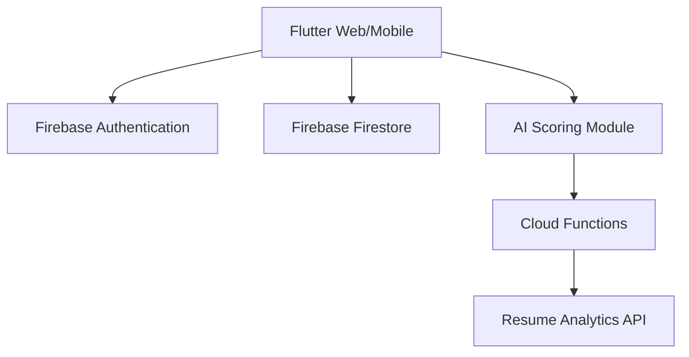

# ScreenerPro - AI-Powered Candidate Screening Dashboard


> **Note:** This is a *Showcase Edition* developed for hackathon presentation purposes. Original business logic and backend integrations are abstracted to protect intellectual property.

## 🚀 Overview

**ScreenerPro** is a state-of-the-art candidate screening platform that leverages AI to automate recruitment workflows. It simplifies the hiring process for HR teams by providing automated resume scoring, an interactive analytics dashboard, and a seamless developer-friendly job board.

### Key Features
- **AI Screening Engine**: Automated resume parsing and scoring based on job requirements.
- **Candidate Analytics**: Interactive dashboard with data visualization for hiring trends.
- **Real-time Collaboration**: Shared hiring pipelines with team feedback loops.
- **Branded Job Board**: Customizable public-facing job listings for businesses.
- **Campaign Creator**: Easy-to-use tool for launching new hiring campaigns in minutes.

---

## 🏗️ Architecture



---

## 📁 Repository Structure

```text
lib/
 ├── screens/     # Premium UI screens (Login, Dashboard)
 ├── widgets/     # Reusable UI components
 ├── services/    # Mock services and API wrappers
 ├── models/      # Data models for candidates/jobs
assets/
 ├── screenshots/ # UI previews for judges
 └── docs/        # Design and architecture diagrams
```

---

## 🛠️ Getting Started (Showcase Setup)

This repository contains the UI and sample logic. To run the showcase:

1. **Install Flutter**: Make sure you have the [latest Flutter SDK](https://docs.flutter.dev/get-started/install).
2. **Setup Firebase**: Create a Firebase project and add your `google-services.json` or `GoogleService-Info.plist`.
3. **Run the App**:
   ```bash
   flutter pub get
   flutter run -d chrome # Or your preferred device
   ```

> [!IMPORTANT]
> This showcase uses dummy credentials and placeholder API keys. Ensure you replace them in `lib/services/firebase_service.dart` for local testing.

---

## 📸 Screenshots

| Login Interface | Dashboard | AI Score Architecture |
| :---: | :---: | :---: |
|  |  |  |

---

## ✨ Developed by
- **Lead Developer**: [Manav Nagpal](https://github.com/manavnagpal08)
- **Project Name**: ScreenerPro
- **Hackathon**: [Hackathon Name 2026]

---
© 2026 ScreenerPro - All Rights Reserved.
