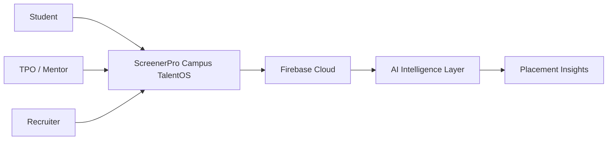
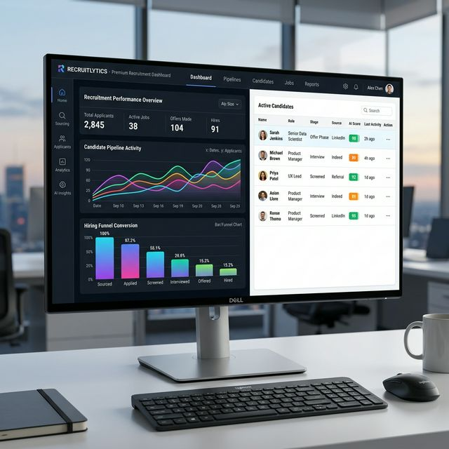
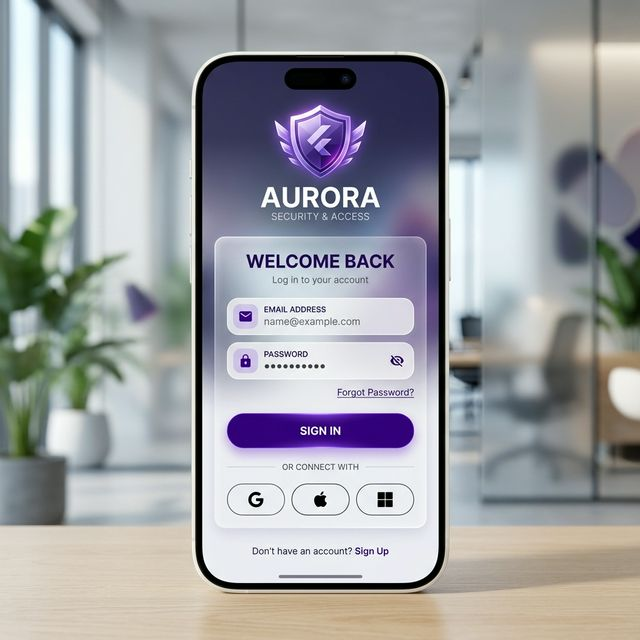
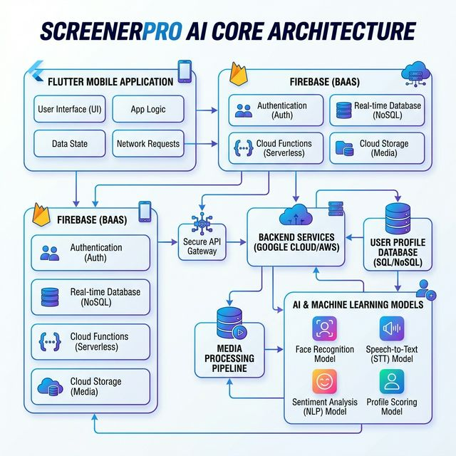

# ScreenerPro Campus TalentOS — The Intelligent Placement Ecosystem

[](https://flutter.dev)
[](https://firebase.google.com)
[](https://dart.dev)
[](https://candiatescr.web.app/)

> **ScreenerPro transforms campus placements into an AI-powered talent intelligence ecosystem by combining Talent Connect, AI Mock Interviews, secure student profiles, and paperless placement workflows.**

### 🌐 Live Platform

[https://candiatescr.web.app/](https://candiatescr.web.app/)

---

## 🚀 Overview

Campus placements are often fragmented, spreadsheet-heavy, and disconnected from real student readiness.

**ScreenerPro Campus TalentOS** is a smart placement intelligence platform designed for **Students, TPOs, Mentors, Alumni, and Recruiters**.

It unifies student discovery, AI-driven preparation, recruiter collaboration, and placement analytics into one seamless ecosystem.

The platform helps colleges modernize placements through **automation, connectivity, sustainability, and innovation-led workflows.**

---


ScreenerPro Campus TalentOS is purpose-built to solve the most critical placement and employability challenges across modern campuses.

### 🛠️ The Service Patch (Campus Logistics)

### **Placement Operations Intelligence**

* Centralized TPO dashboard for student eligibility, applications, and interview schedules
* Real-time placement analytics and automated reporting
* Eliminates spreadsheet-heavy placement workflows
* Streamlines recruiter coordination and hiring campaigns

### 🤝 The Social Patch (Connectivity)

### **Talent Connect Ecosystem**

* Includes **SIG (Student Interest Groups)** for domain-based collaboration in AI, development, design, cybersecurity, and entrepreneurship
* Connects students with recruiters, mentors, seniors, and alumni
* Enables peer-to-peer interview preparation and referral collaboration
* Strengthens the campus placement community through smart networking
* Helps hidden talent become discoverable across departments

### 🌿 The Green Patch (Sustainability)

### **Paperless Placement Workflow**

* Fully digitized resume collection, screening, and ranking
* Reduces paper-heavy resume drives and manual forms
* Creates a sustainable cloud-native placement lifecycle
* Saves administrative time and campus resources

### 🔓 The Open Patch (Innovation)

### **AI Mock Interview + Talent Intelligence**

* AI-powered mock interview engine with role-based feedback
* Resume intelligence and candidate-job fit scoring
* Personalized placement readiness insights
* A future-ready innovation platform for smarter campus hiring

> **ScreenerPro reimagines campus placements as a connected, intelligent, and sustainable ecosystem for students, mentors, recruiters, and TPOs.**

---

## ✨ Core Product Features

### 🚀 Talent Connect Hub

A campus-wide professional networking layer where students can connect with mentors, recruiters, seniors, and alumni for referrals, mock practice, and skill visibility.

### 👥 SIG Student Interest Groups

Dedicated communities where students join interest-based groups such as AI/ML, Flutter, Web Development, Cybersecurity, and Product Design to collaborate on projects, prepare for placements, and build peer learning networks.

### 🤖 AI Mock Interview Engine

Role-based AI interviews with instant communication, confidence, and technical feedback to improve placement readiness.

### 📄 AI Resume Screener

Automated resume parsing, skill extraction, and JD matching for ranking candidates based on company requirements.

### 📊 TPO Insights Dashboard

Advanced analytics dashboard for placement cells to monitor eligibility, interview performance, placement trends, and recruiter activity.

### 💼 Smart Internship & Job Board

A centralized internship and off-campus opportunity board tailored specifically for students.

---

## 🏗️ Architecture & Tech Stack

* **Frontend:** Flutter Web + Mobile
* **Backend:** Firebase + Firestore
* **Authentication:** Firebase Auth
* **Database:** Cloud Firestore
* **AI Layer:** Resume scoring + mock interview intelligence
* **Deployment:** Firebase Hosting



---

## 📁 Repository Structure

```text
lib/
 ├── screens/        # Login, dashboard, talent connect, interview screens
 ├── widgets/        # Reusable UI components
 ├── services/       # Firebase + AI services
 ├── models/         # Candidate, jobs, scores
assets/
 ├── screenshots/    # Platform previews
 └── docs/           # Architecture diagrams
```

---

## 🛠️ Getting Started

```bash
git clone https://github.com/manavnagpal08/candi-flutter.git
cd candi-flutter
flutter pub get
flutter run -d chrome
```

---

## 📸 Platform Previews

| Placement Dashboard | Talent Connect Hub | AI Readiness Flow |
| :---: | :---: | :---: |
|  |  |  |

---

## 💡 Why This Solves Campus Problems

Traditional campus placement systems suffer from poor visibility, lack of preparation support, and manual operational overload.

**ScreenerPro solves this by:**

1. **Improving student-recruiter connectivity** through Talent Connect
2. **Automating placement preparation** using AI mock interviews
3. **Reducing operational burden** for TPOs with centralized analytics
4. **Creating a greener workflow** through paperless placement management
5. **Making campus hiring innovation-driven** with AI readiness insights

---

## 👥 Team

* **Manav Nagpal**  ,
* **Kaaysha Rao** 
---

© 2026 ScreenerPro — Powering the Future of Campus Placements 🚀
