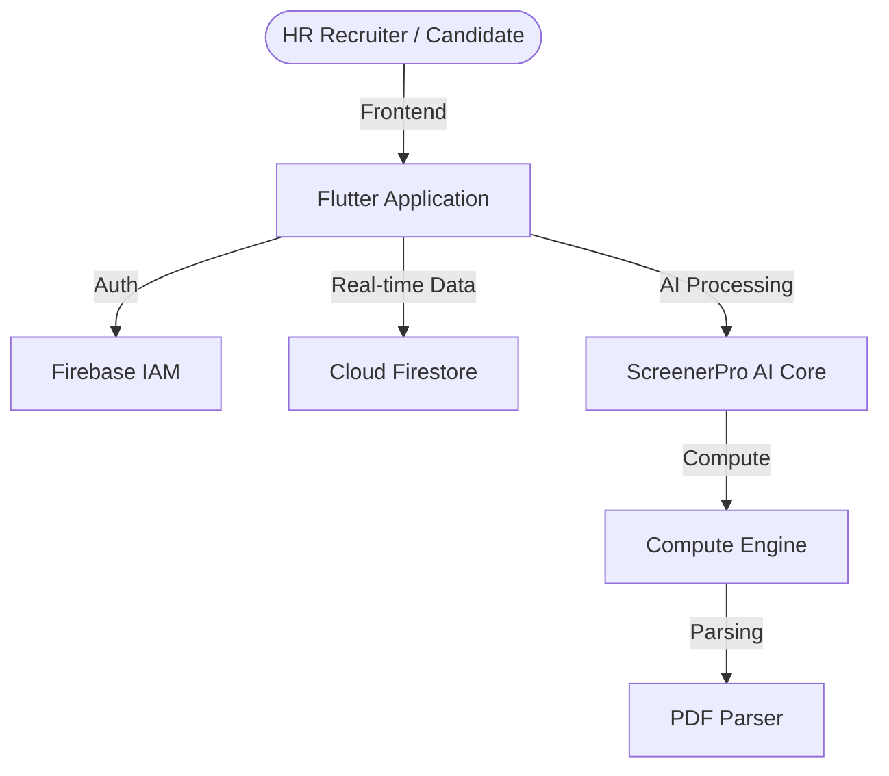

# ScreenerPro — AI-Powered Intelligent Recruitment Ecosystem

[](https://flutter.dev)
[](https://firebase.google.com)
[](https://dart.dev)
[](https://candiatescr.web.app/)

**ScreenerPro** is a Next-Generation AI Recruitment Operating System designed to eliminate the friction in modern hiring workflows. By combining advanced resume parsing algorithms with intuitive candidate analytics, ScreenerPro empowers HR professionals and startups to identify top talent with surgical precision.

### 🌐 [Visit Live Product](https://candiatescr.web.app/)

---

## 🚀 Overview

In a competitive talent market, efficiency is the only differentiator. ScreenerPro is an end-to-end recruitment solution that automates the most time-consuming aspects of the hiring pipeline—from initial screening to candidate onboarding. 

Our mission is to replace manual resume screening with data-driven AI intelligence, ensuring that every recruiter can focus on what truly matters: **the human element of hiring.**

---

## ✨ Core Features

### 🧠 AI-Powered Candidate Screening
- **Automated Resume Scoring**: Instantly rank candidates based on skill match and experience.
- **Natural Language Parsing**: Intelligent extraction of key qualifications, certifications, and project history.
- **Bias-Free Evaluation**: Data-driven scoring to ensure objective recruitment.

### 📊 Recruiter Analytics Dashboard
- **Performance Heatmaps**: Visualize hiring trends across multiple ongoing campaigns.
- **Pipeline Monitoring**: Real-time status tracking for every applicant from 'Applied' to 'Hired'.
- **Collaborative Feedback**: Integrated team scoring system for streamlined decision-making.

### 📢 Scalable Hiring Campaigns
- **Branded Career Portals**: Professional, customizable job boards for small to large enterprises.
- **Campaign Creator**: Launch high-impact hiring campaigns in under 120 seconds.
- **Multi-Platform Integration**: Seamlessly manage applicants from various sources in one centralized hub.

---

## 🛠️ Tech Stack

- **Frontend**: Flutter (Cross-platform Web & Mobile)
- **Backend Architecture**: Firebase Ecosystem
- **Authentication**: Firebase Identity Management
- **Database**: Cloud Firestore (Real-time NoSQL)
- **AI Core**: Proprietary Scoring Algorithms
- **Storage**: Firebase Storage for secure document management

---

## 🏗️ Architecture

ScreenerPro is built on a high-scalability serverless architecture, ensuring 99.9% uptime and low-latency interaction.



---

## 📁 Repository Structure

The ScreenerPro codebase follows a strictly modular architecture for maximum maintainability and rapid feature iteration.

```text
lib/
 ├── core/        # Centralized configurations and utilities
 ├── models/      # Structured Data Contracts for Candidates & Jobs
 ├── screens/     # Highly-optimized UI Modules (Dashboard, Portal, Auth)
 ├── services/    # Business Logic Layer & API Integration
 └── widgets/     # Reusable Atomic UI Components
assets/
 ├── docs/        # Technical Documentation & Diagrams
 └── screenshots/ # High-fidelity Product Previews
```

---

## 🏗️ Setup & Installation

Professional engineers can deploy a local instance of ScreenerPro in minutes.

1. **Clone the Repository**:
   ```bash
   git clone https://github.com/manavnagpal08/candi-flutter.git
   ```
2. **Initialize Service Dependencies**:
   ```bash
   flutter pub get
   ```
3. **Launch Platform**:
   ```bash
   flutter run -d chrome # For Web Instance
   flutter run           # For Mobile/Desktop Instance
   ```

---

## 📸 Screenshots

| Intelligence Dashboard | Secure Authentication | Candidate Analytics |
| :---: | :---: | :---: |
|  |  |  |

---

## 🔮 Future Roadmap

ScreenerPro is an actively evolving ecosystem. Upcoming milestones include:

- [ ] **AI Video Interviews**: Integrated face-to-face screening with sentiment analysis.
- [ ] **Third-party ATS Integration**: Native support for Greenhouse and Lever.
- [ ] **Slack/Teams Notifications**: Real-time hiring updates for internal communications.
- [ ] **Blockchain Verification**: Decentralized verification of academic and professional credentials.

---

## 👥 The Team

ScreenerPro is driven by a passionate team of engineers focused on the future of HR-Tech.

- **Manav Nagpal** — Lead Software Architect
- **Kaaysha Rao** — Product & Strategy

---
© 2026 ScreenerPro - Redefining the Future of Talent Acquisition.
