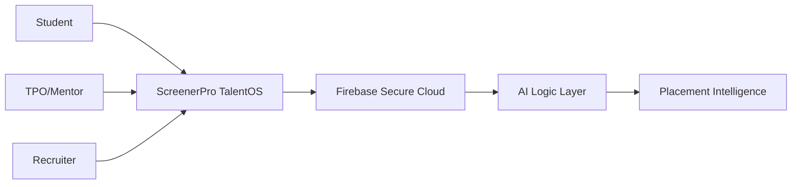

# ScreenerPro Campus TalentOS — The Intelligent Placement Ecosystem

> **"ScreenerPro transforms campus placements into an AI-powered talent intelligence ecosystem by combining Talent Connect, AI Mock Interviews, secure student profiles, and paperless placement workflows."**

### 🌐 [Visit Live Campus Platform](https://candiatescr.web.app/)

---

## 🚀 Overview

Campus placements are traditionally fragmented, manual, and inefficient. **ScreenerPro Campus TalentOS** is a unified Intelligence Platform designed to bridge the gap between Students, Training & Placement Officers (TPOs), Mentors, and Recruiters. 

By automating logistics and providing AI-driven insights, we transform the placement cell from a processing hub into a **talent-first strategic ecosystem.**

---

## 🎯 Alignment with Hackathon Themes

ScreenerPro is built to solve 5 critical "Patches" of the modern campus infrastructure:

### 1. 🛠️ The Service Patch (Campus Logistics)
**Solution: Centralized Placement Analytics Dashboard**
- Optimizes campus logistics by providing TPOs with real-time data on student eligibility, application statuses, and interview schedules.
- Eliminates the chaos of spreadsheets with automated tracking and reporting.

### 2. 🤝 The Social Patch (Connectivity)
**Solution: Talent Connect Hub**
- Facilitates seamless connectivity between students and alumni mentors.
- Empowers peer-to-peer learning and networking through integrated discussion forums and mentor booking systems.

### 3. 🌿 The Green Patch (Sustainability)
**Solution: Paperless Placement Workflow**
- Digitizes 100% of the resume screening and documentation process.
- Replaces physical submission boxes with a secure cloud-native repository, saving thousands of pages per placement cycle.

### 4. 🛡️ The Security Patch (Safety & Data)
**Solution: Secure Student Profiles**
- Implements Firebase-backed military-grade encryption for student data.
- Ensures only verified recruiters and TPOs can access sensitive academic credentials and personal details.

### 5. 🔓 The Open Patch (Innovation)
**Solution: AI Mock Interview Engine**
- Leverages cutting-edge AI to provide students with real-time feedback on their technical and behavioral performance.
- An open innovation framework that evolves with the latest industry interview patterns.

---

## ✨ Core Product Features

- **🚀 Talent Connect Hub**: A networking layer connecting students with recruiters and industry mentors.
- **🤖 AI Mock Interview Engine**: Automated practice sessions with instant AI-driven scorecards and feedback.
- **📄 AI Resume Screener**: Intelligent keyword and intent matching to rank candidates for specific JD requirements.
- **📊 TPO Insights Dashboard**: Enterprise-grade analytics for tracking placement percentages and company performance.
- **💼 Integrated Job Board**: A public gateway for off-campus internships and full-time job listings tailored for students.

---

## 🏗️ Architecture & Tech Stack

ScreenerPro utilizes a high-performance **Serverless Stack** for scalability and reliability.

- **Frontend**: Flutter Web/Mobile (Unified UI Codebase)
- **Backend**: Firebase Cloud Functions & Firestore (Real-time Sync)
- **Security**: Firebase Identity Management & Row-Level Security Rules
- **AI Core**: Proprietary NLP models for resume parsing and sentiment analysis.

---

## 🏗️ Getting Started (Deployment)

1. **Clone**: `git clone https://github.com/manavnagpal08/candi-flutter.git`
2. **Install**: `flutter pub get`
3. **Launch**: `flutter run -d chrome`

---

## 📸 Platform Previews

| Placement Dashboard | Secure Auth | AI Candidate Analysis |
| :---: | :---: | :---: |
|  |  |  |

---

## 💡 Why This Solves Campus Problems?

Traditional campus placement systems suffer from **Information Asymmetry** and **Logistical Fatigue**. ScreenerPro solves this by:
1. **Democratizing Preparation**: AI Mock Interviews give every student equal access to high-quality coaching.
2. **Eliminating Redundancy**: Paperless workflows save time for coordinators and protect the environment.
3. **Informing Decisions**: Data-driven dashboards ensure TPOs focus their efforts on the right students at the right time.
4. **Ensuring Trust**: Secure profiles protect student privacy while simplifying recruiter intake.

---

## 👥 The TalentOS Team

- **Manav Nagpal** — Lead Software Architect
- **Kaaysha Rao** — Product & Strategy

---
© 2026 ScreenerPro - Powering the Future of Campus Placements. 🚀
